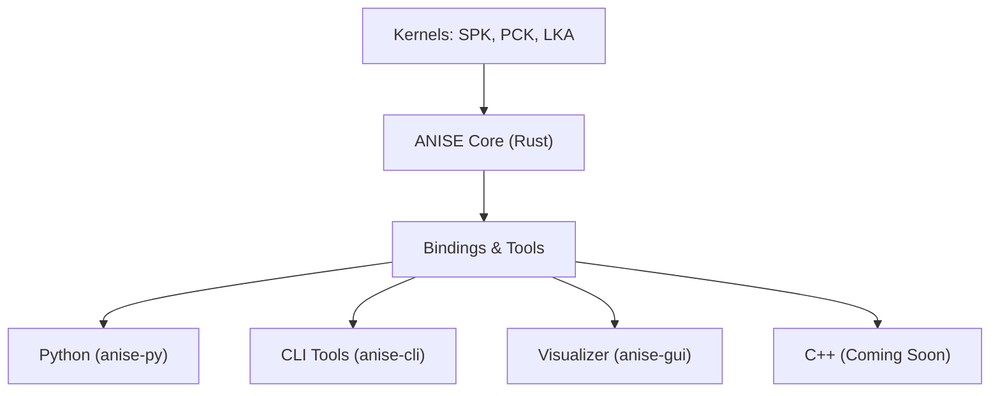

# ANISE: Attitude, Navigation, Instrument, Spacecraft, Ephemeris

## A modern, high-performance toolkit for space mission design and operations.

**NASA TRL 9**: ANISE was used throughout the operations of the Firefly Blue Ghost lunar lander, from launch until successful landing.

-----

## Introduction

Tired of the usual complexities, global state, and lack of thread safety in legacy astrodynamics toolkits? **ANISE** is a fresh, Rust-powered alternative to the NAIF SPICE toolkit, engineered for modern computing environments.

Whether you are plotting a trajectory to Mars, orienting a constellation of satellites, or performing massive parallel analysis on the cloud, ANISE provides the tools you need to get it right.

### Why ANISE?

Space missions demand precision, but modern engineering demands efficiency and safety.

| Feature | CSPICE / SpiceyPy | ANISE |
| :--- | :--- | :--- |
| **Thread Safety** | No (Global state/locks) | **Guaranteed (Rust ownership)** |
| **Performance** | Single-threaded | **Parallel (`many` queries)** |
| **Math Validation** | Runtime errors | **Type-safe Frame checks** |
| **API Style** | Procedural (Integer IDs) | **Object-Oriented / Pythonic** |
| **Serialization** | None | **S-Expressions (Cloud Native)** |

ANISE supports many SPICE kernels. Binary kernels are supported as-is, while text kernels must be transformed into their ANISE equivalent (usually `.pca` or `.lka` files).

| Kernel Type | Supported | Note |
| :--- | :---: | :--- |
| **BSP / SPK** | ✅ | Supported as-is |
| **BPC** | ✅ | Supported as-is |
| **TK (Text)** | 🔄 | Supported after transformation |
| **LSK** | 🔄 | Supported after transformation |
| **GM** | 🔄 | Supported after transformation |
| **CK** | ❌ | Yet to be supported |
| **SCLK** | ❌ | Yet to be supported |
| **DSK** | ❌ | Yet to be supported |
| **IK / EK** | ❌ | Yet to be supported |

### Supported SPK Types

For more details on SPK types, refer to the [NAIF SPK Required Reading](https://naif.jpl.nasa.gov/pub/naif/toolkit_docs/C/req/spk.html). The following table summarizes the types supported by ANISE.

| SPK Type | Interpolation | NAIF SPICE | ANISE | Typically used in |
| :--- | :--- | :---: | :---: | :--- |
| **Type 1** | Modified Differences | ✅ | ✅ | NASA internal trajectory tools (e.g. DPTRAJ) |
| **Type 2** | Chebyshev Triplet | ✅ | ✅ | Planetary ephemerides (e.g., JPL DE series) |
| **Type 3** | Chebyshev Sextuplet | ✅ | ✅ | Planetary ephemerides (e.g., JPL DE series) |
| **Type 5** | Discrete states | ✅ | ❌ | Two-body propagation |
| **Type 8** | Lagrange (Equal Step) | ✅ | 🧪 | Uncommon spacecraft trajectories from numerical integration |
| **Type 9** | Lagrange (Unequal Step) | ✅ | ✅ | Spacecraft trajectories from numerical integration |
| **Type 10** | Space Command TLE | ✅ | ❌ | Please don't use TLEs, a punch-card format (no joke) |
| **Type 12** | Hermite (Equal Step) | ✅ | 🧪 | Uncommon spacecraft trajectories from numerical integration |
| **Type 13** | Hermite (Unequal Step) | ✅ | ✅ | Spacecraft trajectories from numerical integration |
| **Type 14** | Chebyshev Sextuplet (Unequal Step) | ✅ | 🧪 | Never seen in the wild, probably good for slow-moving objects |
| **Type 15** | Precessing Conic Propagation | ✅ | ❌ | Please don't use TLEs, a punch-card format (no joke) |
| **Type 17** | Equinoctial Elements | ✅ | ❌ | [NAIF docs](https://naif.jpl.nasa.gov/pub/naif/toolkit_docs/C/req/spk.html#Type%2017:%20Equinoctial%20Elements) |
| **Type 18** | ESOC/DDID Hermite/Lagrange Interpolation | ✅ | ❌ | [NAIF docs](https://naif.jpl.nasa.gov/pub/naif/toolkit_docs/C/req/spk.html#Type%2018:%20ESOC/DDID%20Hermite/Lagrange%20Interpolation) |
| **Type 19** | ESOC/DDID Piecewise Interpolation | ✅ | ❌ | [NAIF docs](https://naif.jpl.nasa.gov/pub/naif/toolkit_docs/C/req/spk.html#Type%2019:%20ESOC/DDID%20Piecewise%20Interpolation) |
| **Type 20** | Chebyshev Triplet (velocity only) | ✅ | ❌ | [NAIF docs](https://naif.jpl.nasa.gov/pub/naif/toolkit_docs/C/req/spk.html#Type%2020:%20Chebyshev%20velocity%20only) |
| **Type 21** | Extended Modified Difference Arrays | ✅ | ❌ | [NAIF docs](https://naif.jpl.nasa.gov/pub/naif/toolkit_docs/C/req/spk.html#Type%2021:%20Extended%20Modified%20Difference%20Arrays) |

_Note:_ 🧪 means the SPK type is supported but no public SPK of that type could be found to validate the implementation. Please provide one if you have one!

## Architecture

ANISE is a "Core + Bindings" ecosystem. The heavy lifting is done in Rust, ensuring maximum performance and safety, which is then exposed to your language or tool of choice.

## Key Features

  * **Universal Loading**: Seamlessly load SPK, BPC, PCK, FK, TPC, and the new **LKA** (Location Kernel Anise) files.
  * **Analysis Engine**: A declarative system to define engineering reports and events using **S-Expressions**. Define complex queries (eclipses, line-of-sight) on a client and execute them safely on remote workers without arbitrary code execution risks.
  * **Time System Mastery**: Extensive support for all time systems (TT, TAI, ET, TDB, UTC, GPS) powered by the `hifitime` library.
  * **Rigid Body Physics**: Validated high-precision translations, rotations, and rigid body transformations.
  * **Frame Safety**: ANISE checks that all frame translations or rotations are physically valid before performing any computation.
  * **Concurrency**: Designed for modern hardware. Forget about mutexes and race conditions; ANISE guarantees thread safety.

## The Ecosystem

This repository contains the entire ANISE suite:

### 🦀 [ANISE Core (Rust)](./anise/README.md)

The heart of the project. Direct access to the full range of features, memory safety, and robust error handling.

  * **Location**: [`./anise`](./anise/)
  * **Docs**: [API Documentation](https://docs.rs/anise/latest/anise/)

### 🐍 [ANISE Python](./anise-py/README.md)

First-class support for Python. Leverage Rust's speed without leaving your favorite scripting environment. Includes Jupyter notebooks and tutorials.

  * **Location**: [`./anise-py`](./anise-py/)

### 🖥️ [ANISE GUI](./anise-gui/README.md)

A graphical interface to inspect your data files. Quickly check segment start/end times in any time scale (including UNIX UTC seconds) for SPK, BPC, and PCA files.

  * **Location**: [`./anise-gui`](./anise-gui/)

### ⚙️ [ANISE CLI](./anise-cli/)

Command-line utilities for quick file inspection, downloading test data, and converting kernel formats.

  * **Location**: [`./anise-cli`](./anise-cli/)

## Validation

We rigorously validate ANISE against SPICE. Our validation workflow runs:

  * Over **100,000 queries** on the `DE440.bsp` file.
  * **7,305 queries** for each frame in the `PCK08` file (covering 20 years of data).
  * Thousands of rotations from Earth's high-precision BPC file.

**A Note on Precision**: The PCK data from the IAU is based on polynomial approximations expressed in centuries past J2000. While legacy toolkits use floating-point arithmetic for time, ANISE uses `hifitime` (integer arithmetic) for all time computations. You might see discrepancies of up to 1 millidegree in rotation angles, but this represents ANISE's higher temporal precision avoiding floating-point rounding errors.

## Resources and Assets

Nyx Space provides several important SPICE files for your convenience:

  * **[de440s.bsp](http://public-data.nyxspace.com/anise/de440s.bsp)**: JPL's latest ephemeris dataset (1900-2050).
  * **[de440.bsp](http://public-data.nyxspace.com/anise/de440.bsp)**: JPL's long-term ephemeris dataset.
  * **[pck08.pca](http://public-data.nyxspace.com/anise/v0.7/pck08.pca)**: Planetary constants kernel (ANISE format), built from JPL's gravitational data.
  * **[moon_fk_de440.epa](http://public-data.nyxspace.com/anise/v0.7/moon_fk_de440.epa)**: A Moon frame kernel built from JPL data.

> **Note on Lunar Frames**: For accurate lunar work, we recommend using the `moon_fk_de440.epa` file with `moon_pa_de440_200625.bpc` (Principal Axes) and an ephemeris file (e.g., `de440.bsp`), rather than the low-fidelity IAU Moon frame. See [`moon_de440_220930.txt`](./data/moon_de440_220930.txt) for details.

## Contributing

ANISE is an open-source project, and we welcome contributions! Whether you want to request a feature, report a bug, contribute code, or improve the documentation, we appreciate your help.

## License

ANISE is distributed under the Mozilla Public License 2.0 (MPL-2.0). This license allows you to use ANISE in both open and proprietary software, with the requirement that any modifications to the ANISE source code are also released under the MPL-2.0.

For more details, see the [full license text](./LICENSE) or a [summary on GitHub](https://choosealicense.com/licenses/mpl-2.0/).

## Acknowledgements

ANISE is heavily inspired by the NAIF SPICE toolkit and its excellent documentation.

## Contact

Have questions or feedback? [Open an issue on GitHub](https://github.com/nyx-space/anise/issues) or email the maintainer at `christopher.rabotin@gmail.com`.
