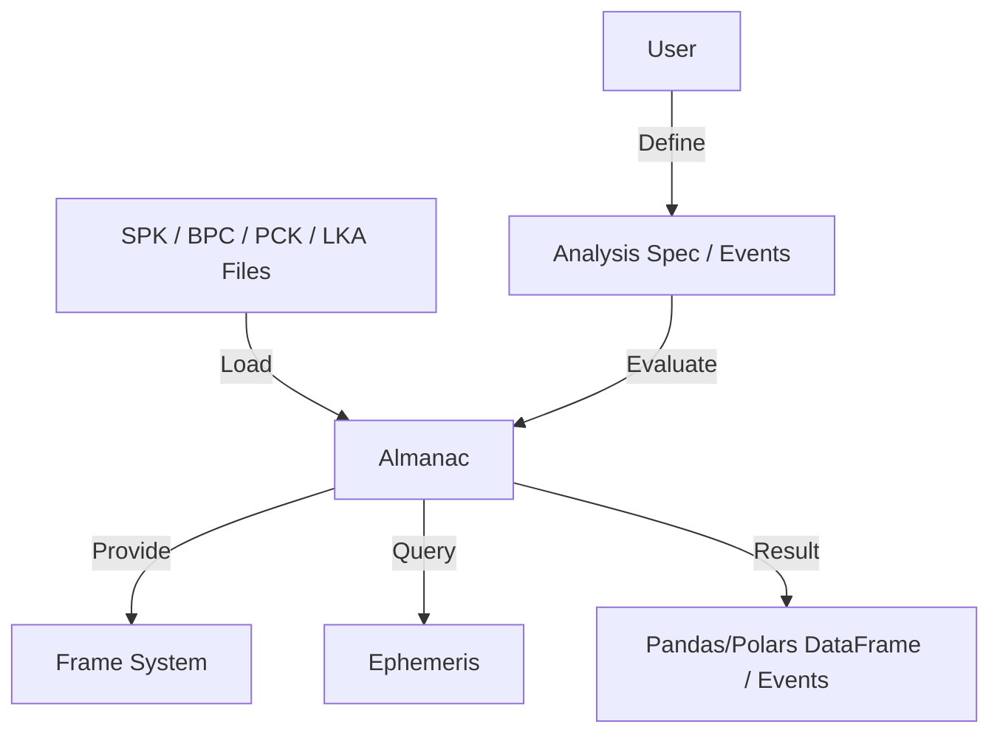

# ANISE (Attitude, Navigation, Instrument, Spacecraft, Ephemeris)

ANISE is a modern rewrite of the core functionalities of the NAIF SPICE toolkit with enhanced features and ease of use, leveraging Rust's safety and speed.

## Introduction

In the realm of space exploration, navigation, and astrophysics, precise and efficient computation of spacecraft position, orientation, and time is critical. ANISE, standing for "Attitude, Navigation, Instrument, Spacecraft, Ephemeris," offers a Rust-native approach to these challenges. This toolkit provides a suite of functionalities including but not limited to:

  + **Universal Loading**: Seamlessly load SPK, BPC, PCK, FK, TPC, and the new **LKA** (Location Kernel Anise) files.
  + **Rigid Body Physics**: High-precision translations, rotations, and their combination (rigid body transformations).
  + **Parallel Querying**: Query SPICE files in parallel at incredible speeds (~ 125,000 queries per second) using the `many` keyword.
  + **Declarative Analysis**: Build complex mathematical vector and scalar expressions (e.g., angles, projections, orbital elements) and evaluate them efficiently over time series.
  + **Event Finding**: High-precision search for eclipses, AOS/LOS, and orbital events (periapsis/apoapsis).
  + **Hifitime Integration**: Comprehensive time system conversions using the `hifitime` library (TT, TAI, ET, TDB, UTC, GPS, etc.).
  + **CCSDS OEM**: ANISE supports reading, writing, and interpolating CCSDS OEM files, including their covariance, in the inertial, RIC, RCN, and VNC frames.

ANISE stands validated against the traditional SPICE toolkit, ensuring accuracy and reliability, with translations achieving machine precision (2e-16) and rotations presenting minimal error.

## Why ANISE?

A quick comparison with the traditional CSPICE toolkit:

| Feature | CSPICE (Toolkit) | ANISE |
| :--- | :--- | :--- |
| **Thread Safety** | No (Global state/locks) | **Guaranteed (Rust ownership)** |
| **Performance** | Single-threaded | **Parallel (`many` queries)** |
| **Math Validation** | Runtime errors | **Type-safe Frame checks** |
| **API Style** | Procedural (Integer IDs) | **Object-Oriented / Pythonic** |
| **Serialization** | None | **S-Expressions (Cloud Native)** |

ANISE supports many SPICE kernels. Binary kernels are supported as-is, while text kernels must be transformed into their ANISE equivalent (usually `.pca` or `.lka` files).

| Kernel Type | Supported | Note |
| :--- | :---: | :--- |
| **BSP / SPK** | ✅ | Supported as-is |
| **BPC** | ✅ | Supported as-is |
| **TK (Text)** | 🔄 | Supported after transformation |
| **LSK** | 🔄 | Supported after transformation |
| **GM** | 🔄 | Supported after transformation |
| **CK** | ❌ | Yet to be supported |
| **SCLK** | ❌ | Yet to be supported |
| **DSK** | ❌ | Yet to be supported |
| **IK / EK** | ❌ | Yet to be supported |

### Supported SPK Types

For more details on SPK types, refer to the [NAIF SPK Required Reading](https://naif.jpl.nasa.gov/pub/naif/toolkit_docs/C/req/spk.html). The following table summarizes the types supported by ANISE.

| SPK Type | Interpolation | NAIF SPICE | ANISE | Typically used in |
| :--- | :--- | :---: | :---: | :--- |
| **Type 1** | Modified Differences | ✅ | ✅ | NASA internal trajectory tools (e.g. DPTRAJ) |
| **Type 2** | Chebyshev Triplet | ✅ | ✅ | Planetary ephemerides (e.g., JPL DE series) |
| **Type 3** | Chebyshev Sextuplet | ✅ | ✅ | Planetary ephemerides (e.g., JPL DE series) |
| **Type 5** | Discrete states | ✅ | ❌ | Two-body propagation |
| **Type 8** | Lagrange (Equal Step) | ✅ | 🧪 | Uncommon spacecraft trajectories from numerical integration |
| **Type 9** | Lagrange (Unequal Step) | ✅ | ✅ | Spacecraft trajectories from numerical integration |
| **Type 10** | Space Command TLE | ✅ | ❌ | Please don't use TLEs, a punch-card format (no joke) |
| **Type 12** | Hermite (Equal Step) | ✅ | 🧪 | Uncommon spacecraft trajectories from numerical integration |
| **Type 13** | Hermite (Unequal Step) | ✅ | ✅ | Spacecraft trajectories from numerical integration |
| **Type 14** | Chebyshev Sextuplet (Unequal Step) | ✅ | ❌ | Never seen in the wild, probably good for slow-moving objects |
| **Type 15** | Precessing Conic Propagation | ✅ | ❌ | Precessing conic elements |
| **Type 17** | Equinoctial Elements | ✅ | ❌ | [NAIF docs](https://naif.jpl.nasa.gov/pub/naif/toolkit_docs/C/req/spk.html#Type%2017:%20Equinoctial%20Elements) |
| **Type 18** | ESOC/DDID Hermite/Lagrange Interpolation | ✅ | ❌ | [NAIF docs](https://naif.jpl.nasa.gov/pub/naif/toolkit_docs/C/req/spk.html#Type%2018:%20ESOC/DDID%20Hermite/Lagrange%20Interpolation) |
| **Type 19** | ESOC/DDID Piecewise Interpolation | ✅ | ❌ | [NAIF docs](https://naif.jpl.nasa.gov/pub/naif/toolkit_docs/C/req/spk.html#Type%2019:%20ESOC/DDID%20Piecewise%20Interpolation) |
| **Type 20** | Chebyshev Triplet (velocity only) | ✅ | ❌ | [NAIF docs](https://naif.jpl.nasa.gov/pub/naif/toolkit_docs/C/req/spk.html#Type%2020:%20Chebyshev%20velocity%20only) |
| **Type 21** | Extended Modified Difference Arrays | ✅ | ❌ | [NAIF docs](https://naif.jpl.nasa.gov/pub/naif/toolkit_docs/C/req/spk.html#Type%2021:%20Extended%20Modified%20Difference%20Arrays) |


_Note:_ 🧪 means the SPK type is supported but no public SPK of that type could be found to validate the implementation. Please provide one if you have one!

## Features

  + **High Precision**: Matches SPICE to machine precision in translations and minimal errors in rotations.
  + **Analysis Engine**: A new declarative system to define engineering reports and events using S-Expressions, separating the *definition* of a calculation from its *execution*.
      + *Cloud Native*: S-Expressions are serializable, allowing you to define complex queries on a client and execute them safely on remote workers without arbitrary code execution risks.
  + **Ground Station Management**: First-class support for `Location` objects, terrain masks, and visibility calculations.
  + **Rust Efficiency**: Harnesses the speed and safety of Rust for space computations.
  + **Multi-threaded**: ANISE is designed for modern hardware. Forget about mutexes and race conditions; ANISE *guarantees* thread safety.
  + **Frame Safety**: ANISE checks that all frame translations or rotations are physically valid before performing any computation.

## Architecture



## Tutorials

- [01 - Querying SPK files](./tutorials/Tutorial%2001%20-%20Querying%20SPK%20files.ipynb)
- [02 - Loading remote and local files (MetaAlmanac)](./tutorials/Tutorial%2002%20-%20Loading%20remote%20SPICE%20and%20ANISE%20files%20(meta%20almanac).ipynb)
- [03 - Defining and working with the orbit structure](./tutorials/Tutorial%2003%20-%20Defining%20and%20working%20with%20the%20Orbit%20structure.ipynb)
- [04 - Computing azimuth, elevation, and range data (AER)](./tutorials/Tutorial%2004%20-%20Computing%20Azimuth%20Elevation%20and%20Range%20data.ipynb)
- [05 - Using frame kernels and text planetary kernels](./tutorials/Tutorial%2005%20-%20Using%20frame%20kernels%20and%20text%20planetary%20kernels.ipynb)
- [06 - Sun probe Earth angle](./tutorials/Tutorial%2006%20-%20Sun%20probe%20Earth%20angle.ipynb)
- [07 - Analysis](./tutorials/Tutorial%2007%20-%20Analysis.ipynb)
- [08 - OEM and Covariance](./tutorials/Tutorial%2008%20-%20OEM%20and%20Covariance.ipynb)


*Note: The tutorials can be viewed in read-only form on [the Github repo](https://github.com/nyx-space/anise/tree/master/anise-py/tutorials).*

## Usage

ANISE is available on PyPI with pre-built wheels for Linux, macOS (Intel/Silicon), and Windows.

Start by adding anise to your project: `pip install anise`.

*Note: for the very latest usage examples, refer to the [Python tests](./tests).*

### 1. Basic Navigation & Transformations

The core of ANISE is the `Almanac`, which manages frames and ephemerides.

```python
from anise import Almanac
from anise.astro import Orbit
from anise.constants import Frames
from anise.time import Epoch
from pathlib import Path

# Load your kernels (BSP, PCK, etc.)
# Note: Almanac functions are immutable; they return a NEW Almanac instance.
data_path = Path("../data")
almanac = Almanac(str(data_path.joinpath("de440s.bsp")))
almanac = almanac.load(str(data_path.joinpath("pck08.pca")))

# Access Frame properties directly
eme2k = almanac.frame_info(Frames.EME2000)
print(f"Earth GM: {eme2k.mu_km3_s2()} km³/s²")

# Define an Orbit state
epoch = Epoch("2021-10-29 12:34:56 TDB")
orig_state = Orbit.from_keplerian(
    8_191.93,   # SMA (km)
    1e-6,       # Eccentricity
    12.85,      # Inclination (deg)
    306.614,    # RAAN (deg)
    314.19,     # Arg Peri (deg)
    99.887_7,   # True Anomaly (deg)
    epoch,
    eme2k,
)

# Transform to a new frame (e.g., Earth Fixed / ITRF)
# Note: If high-precision Earth orientation files (BPC) aren't loaded, 
# this uses the IAU approximation.
state_itrf93 = almanac.transform_to(orig_state, Frames.IAU_EARTH_FRAME)

print(f"Lat: {state_itrf93.latitude_deg():.4f} deg")
print(f"Lon: {state_itrf93.longitude_deg():.4f} deg")
print(f"Alt: {state_itrf93.height_km():.4f} km")
```

### 2. Analysis & Event Finding

ANISE allows you to build declarative expressions for scalars and vectors. These are optimized in Rust and can be used to generate reports or find events (like eclipses) efficiently. These calculations are **500x** faster than Ansys STK.

```python
import anise.analysis as analysis
from anise import Almanac
from anise.constants import Frames, Orientations
from anise.astro improt Frame
from anise.time import Epoch, Unit

# Define the state we want to analyze (e.g., LRO orbiting the Moon)
lro_state = analysis.StateSpec(
    target_frame=analysis.FrameSpec.Loaded(Frame(-85, Orientations.J2000)),  # -85 is the LRO ID
    observer_frame=analysis.FrameSpec.Loaded(Frames.MOON_J2000),
    ab_corr=None,
)

# 1. Define an Event: Find when the Sun sets (elevation < 0) as seen by LRO
sun_set_event = analysis.Event(
    analysis.ScalarExpr.SunAngle(observer_id=-85), # ID -85
    analysis.Condition.LessThan(90.0), # Angle > 90 deg means sun is behind horizon
    Unit.Second * 0.5, # Precision (Units handled automatically)
    ab_corr=None,
)

# 2. Define a Report: Calculate altitude and beta angle over time
report_spec = analysis.ReportScalars([
    (analysis.ScalarExpr.Norm(analysis.VectorExpr.Radius(lro_state)), "Dist (km)"),
    (analysis.ScalarExpr.BetaAngle(), "Beta (deg)"),
], lro_state)

# Load data and execute
almanac = Almanac("../data/de440s.bsp").load("../data/lro.bsp")
start = Epoch("2025-01-01 12:00:00 UTC")
end = start + Unit.Day * 1

# Find all sunset intervals
sunset_arcs = almanac.report_event_arcs(lro_state, sun_set_event, start, end)
print(f"Found {len(sunset_arcs)} sunset intervals.")

# Generate data for the report
from anise.time import TimeSeries
series = TimeSeries(start, end, Unit.Minute * 10, inclusive=True)
data = almanac.report_scalars(report_spec, series)
# 'data' is a dictionary keyed by epoch strings, ready for pandas/plotting
```

### 3. Ground Stations

You can create and save Location Kernels (`.lka`) containing ground station coordinates and terrain masks.

```python
from anise.astro import Location, TerrainMask, FrameUid

# Define a station with a visibility mask
mask = [TerrainMask(0.0, 5.0), TerrainMask(35.0, 10.0)] # Azimuth, Min Elevation
dss65 = Location(
    40.427, 4.250, 0.834, # Lat, Lon, Height (km)
    FrameUid(399, 399),   # On Earth
    mask,
    terrain_mask_ignored=False
)

# Calculate visibility
# (See tutorials for full implementation of visibility arcs)
```

## Development

1.  Install `maturin`, e.g. via `pipx` as `pipx install maturin`
2.  Create a virtual environment: `cd anise/anise-py && python3 -m venv .venv`
3.  Jump into the virtual environment and install `patchelf` for faster builds: `pip install patchelf`, and `pytest` for the test suite: `pip install pytest`
4.  Run `maturin develop` to build the development package and install it in the virtual environment
5.  Finally, run the tests `python -m pytest`

To run the development version of ANISE in a Jupyter Notebook, install ipykernels in your virtual environment.

1.  `pip install ipykernel`
2.  Now, build the local kernel: `python -m ipykernel install --user --name=.venv`
3.  Then, start jupyter notebook: `jupyter notebook`
4.  Open the notebook, click on the top right and make sure to choose the environment you created just a few steps above.

### Generating the pyi type hints

Type hints are extremely useful for Python users. Building them is a bit of manual work.

1.  `maturin develop` to build the latest library
2.  `python generate_stubs.py anise anise.pyi` builds the top level type hints
3.  Repeat for all submodules: `utils`, `time`, `astro`, `astro.constants`, `rotation`, `analysis` writing to a new file each time:
    1.  `python generate_stubs.py anise.astro anise.astro.pyi`
    2.  `python generate_stubs.py anise.time anise.time.pyi`
    3.  `python generate_stubs.py anise.astro.constants anise.astro.constants.pyi`
    4.  `python generate_stubs.py anise.utils anise.utils.pyi`
    5.  `python generate_stubs.py anise.rotation anise.rotation.pyi`
    6.  `python generate_stubs.py anise.analysis anise.analysis.pyi`
4.  Final, concat all of these new files back to `anise.pyi` since that's the only one used by `maturin`.

## Citation

If you use ANISE in your research, please cite it as follows:

```bibtex
@software{nyx_space_anise_2025,
  author = {Christopher Rabotin},
  title = {ANISE: Attitude, Navigation, Instrument, Spacecraft, Ephemeris},
  year = {2025},
  publisher = {Nyx Space},
  url = {https://github.com/nyx-space/anise}
}
```
